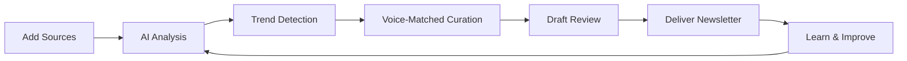

# 📰 Loki AI Newsletter

> **Transform scattered content into curated intelligence.**  
> An AI-powered newsletter platform that learns your voice, tracks trending topics, and delivers personalized content from your custom sources.

[](https://www.python.org/downloads/)
[](https://streamlit.io)
[](https://opensource.org/licenses/MIT)

---

## 🎯 What is Loki?

Loki is an intelligent newsletter curation system that acts as your personal content analyst. Instead of manually browsing multiple sources, Loki automatically:

- **Scrapes** your custom content sources (YouTube, Twitter, Reddit, RSS feeds, websites)
- **Analyzes** trending topics using AI and market intelligence
- **Curates** personalized newsletters in your unique writing style
- **Delivers** polished content ready to send

Perfect for content creators, researchers, marketers, and teams who need to stay informed without the overwhelm.

---

## ✨ Core Capabilities

### 🤖 **AI-Powered Content Curation**
Move beyond simple RSS aggregation. Loki uses **Groq's LLaMA 4 models** to:
- Intelligently summarize and synthesize content across sources
- Extract key insights and actionable takeaways
- Generate coherent narratives from scattered information
- Filter noise and prioritize quality content

### 🎨 **Voice Training & Style Matching**
Your newsletter should sound like *you*. Upload sample newsletters and Loki:
- Extracts your writing style, tone, and voice patterns
- Learns your content preferences and format choices
- Generates new newsletters that match your unique style
- Adapts to feedback for continuous improvement

### 📊 **Advanced Trend Intelligence**
Stay ahead of the curve with multi-layered trend detection:
- **Real-time analysis** of your custom content sources
- **Market correlation** with Google Trends data
- **Spike detection** with severity levels (critical/high/moderate)
- **Auto-monitoring** with configurable refresh intervals
- **Correlation insights** between your content and broader market trends

### 📝 **Interactive Draft System**
Full control over your content:
- Review AI-generated drafts before sending
- Edit directly in the browser
- Provide feedback for instant regeneration
- Approve and send with one click
- Email delivery via Resend API

### 🗂️ **Dynamic Source Management**
Aggregate content from anywhere:
- YouTube channels and videos
- Twitter/X accounts and threads
- Reddit communities and discussions
- RSS feeds and blogs
- Any website with Firecrawl integration
- Priority-based scraping for time-sensitive sources

---

## 🎬 How It Works



1. **Add Your Sources**: YouTube, Twitter, RSS feeds, or any website
2. **AI Analyzes Content**: LLaMA models extract insights and trends
3. **Trend Intelligence**: Correlate with market data and detect spikes
4. **Voice-Matched Generation**: Create newsletters in your unique style
5. **Review & Refine**: Edit drafts and provide feedback
6. **Deliver**: Send polished newsletters via email
7. **Continuous Learning**: AI improves based on your feedback

---

## 🚀 Get Started

### Option 1: Deploy to Streamlit Cloud (Fastest)
Perfect for immediate use without local setup.

**See [QUICK_DEPLOY.md](QUICK_DEPLOY.md)** for 5-minute deployment.

### Option 2: Local Development
For customization and development.

**See [DEPLOYMENT_GUIDE.md](DEPLOYMENT_GUIDE.md)** for complete setup instructions.

### Prerequisites
- Python 3.10+
- API Keys: [Supabase](https://supabase.com), [Groq](https://console.groq.com), [Firecrawl](https://firecrawl.dev), [Resend](https://resend.com)

---

## 💡 Use Cases

### 📰 **Content Creators & Newsletters**
- Aggregate content from 20+ sources in minutes
- Generate drafts in your established voice
- Track what's trending in your niche
- Send polished newsletters to subscribers

### 🔬 **Researchers & Academics**
- Monitor multiple journals and publications
- Synthesize findings into digestible summaries
- Track emerging research trends
- Share curated updates with colleagues

### 📈 **Marketers & Strategists**
- Track competitor content and industry news
- Identify trending topics for content planning
- Generate market intelligence reports
- Stay ahead of industry conversations

### 👥 **Teams & Organizations**
- Curate internal knowledge from multiple channels
- Share weekly roundups with stakeholders
- Monitor relevant industry developments
- Centralize scattered information sources

---

## 🏗️ Architecture

### **Three-Layer Intelligence System**

**Layer 1: Multi-Source Aggregation**
- Firecrawl for intelligent web scraping
- Native YouTube, Twitter, Reddit parsers
- RSS/Atom feed readers
- Configurable scraping priorities

**Layer 2: AI Analysis Engine**
- Groq LLaMA 4 for content understanding
- Trend detection with frequency analysis
- Market correlation with Google Trends
- Statistical spike detection

**Layer 3: Personalization & Delivery**
- Voice feature extraction from samples
- Style-matched content generation
- Interactive draft refinement
- Email delivery via Resend

---

## 🎨 Screenshots & Demo

### **Dashboard**
Modern, intuitive interface for managing sources and generating newsletters.

### **Trend Analysis**
Real-time visualization of trending topics and market intelligence.

### **Voice Training**
Upload samples and see extracted style features instantly.

### **Draft Review**
Interactive editing with AI-powered regeneration based on feedback.

> *Screenshots coming soon*

---

## 📊 Key Metrics

| Feature | Capability |
|---------|------------|
| **Sources Supported** | YouTube, Twitter, Reddit, RSS, Any Website |
| **AI Model** | Groq LLaMA 4 Maverick (17B parameters) |
| **Trend Detection** | Real-time + Market Correlation |
| **Voice Learning** | LLM-based style extraction |
| **Email Delivery** | Resend API integration |
| **Database** | PostgreSQL via Supabase |
| **Authentication** | Secure email-based with RLS |

---


---

## 🔧 Technology Stack

### **Frontend & UI**
```
Streamlit              → Web framework
streamlit-shadcn-ui    → Modern UI components
```

### **AI & Intelligence**
```
Groq LLaMA 4          → Content curation & analysis
                      → Voice feature extraction
                      → Trend analysis
```

### **Data & Scraping**
```
Firecrawl             → Intelligent web crawling
BeautifulSoup4        → HTML parsing
Feedparser            → RSS/Atom feeds
youtube-transcript-api → YouTube content
pytrends              → Google Trends API
```

### **Backend & Infrastructure**
```
Supabase              → PostgreSQL database
                      → Authentication
                      → Row Level Security
Resend                → Email delivery
Python 3.10+          → Core language
```

### **Key Advantages**
- ⚡ **Fast AI Inference**: Groq delivers sub-second response times
- 🔒 **Enterprise Security**: RLS policies protect user data
- 🌐 **Multi-Source**: Unified interface for diverse content
- 🎯 **Personalization**: True voice matching, not templates
- 📈 **Market Intelligence**: Google Trends correlation

---


## 🔒 Security & Privacy

### **Authentication**
- Secure email-based authentication via Supabase
- Password reset functionality
- Session management with automatic timeout

### **Data Protection**
- Row Level Security (RLS) on all database tables
- Users can only access their own data
- API keys stored in encrypted secrets
- No data sharing between users

### **API Security**
- All secrets in `.streamlit/secrets.toml` (gitignored)
- Environment-based configuration
- No hardcoded credentials
- Automatic fallback to environment variables

### **Content Privacy**
- Voice training features stored, not full content
- User sources kept private
- Optional email delivery (can review offline)

---

## 🎓 Learning Resources

### **Getting Started**
1. Review the [QUICK_DEPLOY.md](QUICK_DEPLOY.md) guide
2. Watch the architecture diagram above
3. Test with sample sources
4. Upload voice training samples
5. Generate your first newsletter

### **Advanced Usage**
- Configure trend monitoring intervals
- Set up custom source priorities
- Fine-tune voice training with more samples
- Use feedback loop for style refinement
- Export newsletters for external tools

### **Best Practices**
- Start with 5-10 quality sources
- Upload 2-3 voice training samples minimum
- Review drafts before sending
- Monitor trend spikes for timely content
- Regularly update source priorities

---

## 🚧 Roadmap

### **Current Features** ✅
- Multi-source content aggregation
- AI-powered curation with LLaMA 4
- Voice training and style matching
- Trend detection and spike alerts
- Market intelligence correlation
- Draft review and regeneration
- Email delivery


## 📝 License

This project is open source and available under the [MIT License](LICENSE).

```
MIT License - You are free to:
✓ Use commercially
✓ Modify
✓ Distribute
✓ Private use
```

---

## 🆘 Support & Community

### **Getting Help**
1. 📚 Check the [Documentation](#-documentation) section
2. 🔍 Review [DEPLOYMENT_GUIDE.md](DEPLOYMENT_GUIDE.md) troubleshooting
3. 🐛 Search [GitHub Issues](../../issues)
4. 💬 Start a [Discussion](../../discussions)

### **Service-Specific Support**
- **Streamlit**: [docs.streamlit.io](https://docs.streamlit.io)
- **Supabase**: [supabase.com/docs](https://supabase.com/docs)
- **Groq**: [console.groq.com/docs](https://console.groq.com/docs)
- **Firecrawl**: [docs.firecrawl.dev](https://docs.firecrawl.dev)
- **Resend**: [resend.com/docs](https://resend.com/docs)

---

## 🎉 Acknowledgments

**Built with cutting-edge technology:**

| Technology | Purpose | Why We Love It |
|------------|---------|----------------|
| [Streamlit](https://streamlit.io) | Web Framework | Pure Python, beautifully simple |
| [Supabase](https://supabase.com) | Database & Auth | Open source Firebase alternative |
| [Groq](https://groq.com) | AI Inference | Lightning-fast LLaMA inference |
| [Firecrawl](https://firecrawl.dev) | Web Scraping | Intelligent, reliable crawling |
| [Resend](https://resend.com) | Email Delivery | Modern email for developers |

**Special thanks to:**
- The open-source community for amazing tools
- Early testers for valuable feedback
- Contributors who help improve Loki

---

## 📊 Project Stats


---

<div align="center">

### **Ready to transform your content workflow?**

**[🚀 Deploy Now](QUICK_DEPLOY.md)** · **[📖 Read Docs](DEPLOYMENT_GUIDE.md)** · **[⭐ Star Repository](../../)**

---

**Built with ❤️ for content creators, researchers, and teams worldwide**

*Loki AI Newsletter - Your intelligent content companion*

</div>
